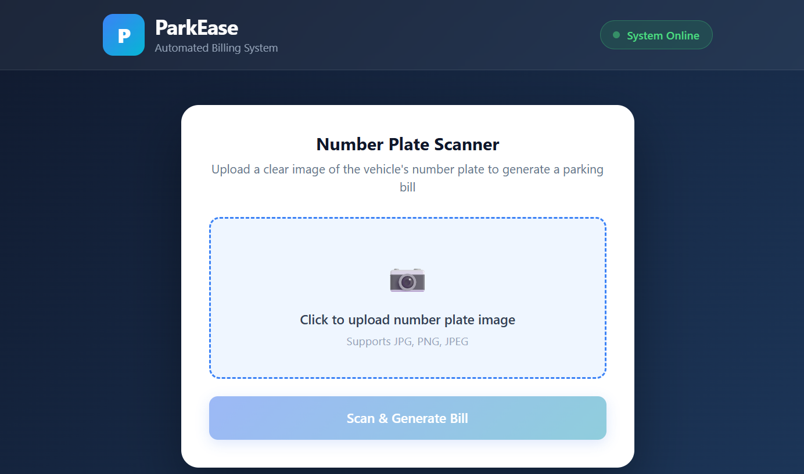
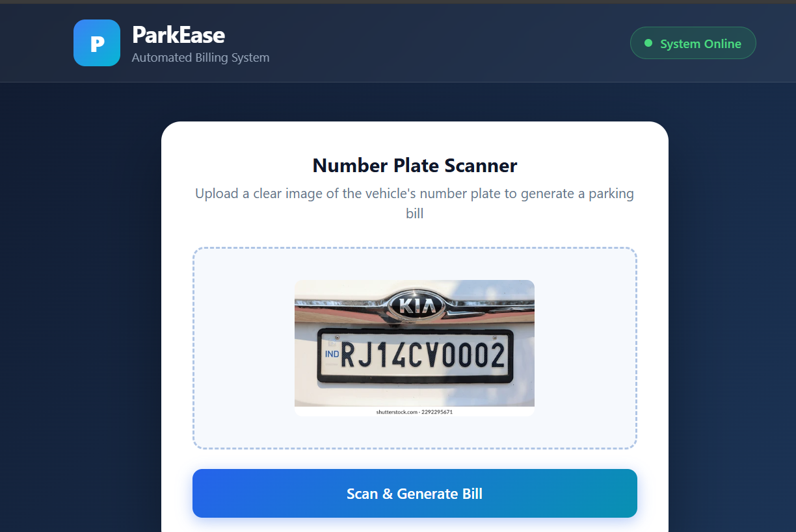
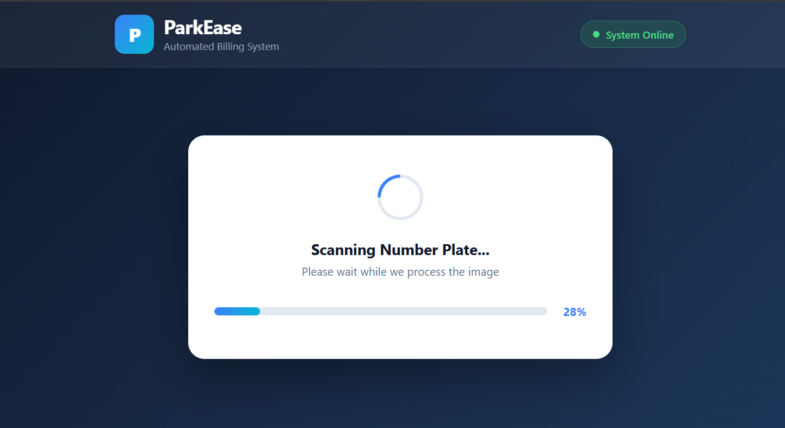
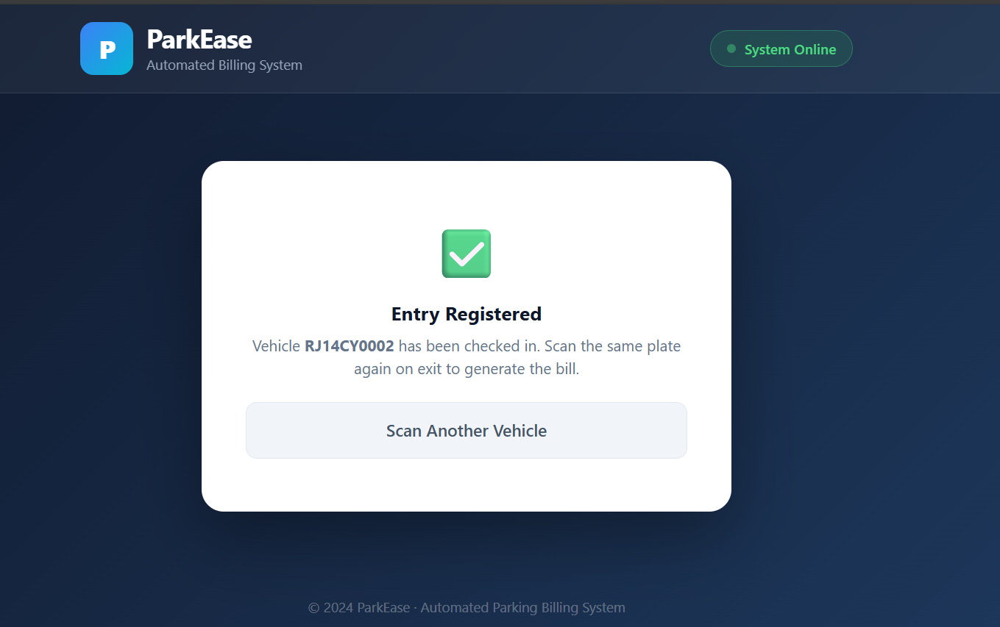
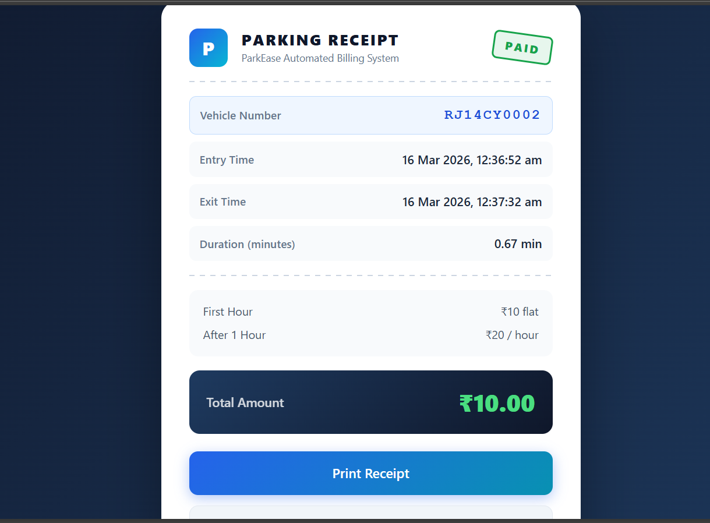
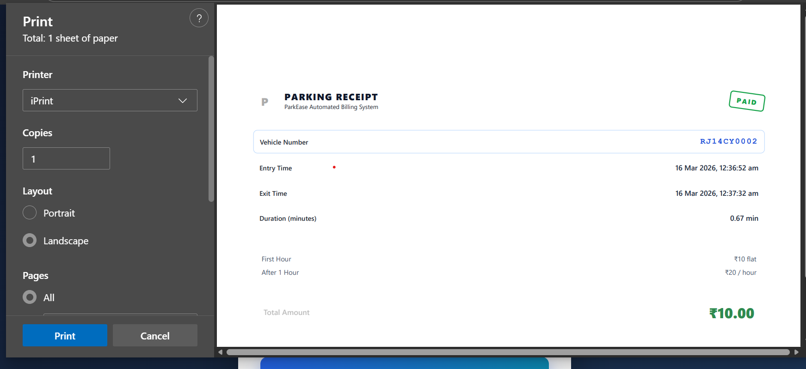

# ParkEase — Automated Parking Billing System

ParkEase is a full-stack web application that automates parking fee calculation using OCR (Optical Character Recognition). Operators simply upload a photo of a vehicle's number plate; the system reads the plate, checks the vehicle's entry time from the database, calculates the parking duration, and generates a printable receipt — all in seconds.

---

## Tech Stack

| Layer      | Technology                              |
| ---------- | --------------------------------------- |
| Frontend   | React, Tesseract.js, Axios, Bootstrap 5 |
| Backend    | Node.js, Express                        |
| Database   | MongoDB Atlas (Mongoose)                |
| OCR Engine | Tesseract.js (in-browser)               |

---

## Features

- OCR-based number plate scanning directly in the browser
- Automatic entry/exit time tracking via MongoDB
- Parking fee calculation (flat ₹10 for first hour, ₹20/hour after)
- Printable parking receipt
- Responsive, professional UI

---

## Getting Started

### Prerequisites

- Node.js v16+
- MongoDB Atlas account

### Backend

```bash
cd backend
npm install
# Create a .env file with your MongoDB URI:
# MONGO_URI=mongodb+srv://<user>:<password>@cluster0.xxxxx.mongodb.net/<dbname>
node index.js
```

### Frontend

```bash
cd frontend
npm install
# Create a .env file:
# REACT_APP_API_URL=http://localhost:5000
npm start
```

The app runs at `http://localhost:3000`.

---

## Screenshots

### 1. Start Page

> The landing screen with the ParkEase header and number plate scanner card.




---

### 2. Upload Image

> The operator clicks the upload zone and selects a number plate image. A preview appears before scanning.



---

### 3. Processing / Scanning

> Tesseract.js processes the image in the browser. An animated spinner and live progress bar show the OCR progress.




---

### 4. Vehicle Entry Registered

> When a vehicle is detected for the first time, a new entry is created in the database and the operator is notified.




---

### 5. Uploading the Image Again (Exit Scan)

> The same plate is scanned again on exit. The system matches it against the stored entry record.


---

### 6. Parking Bill Generated

> The receipt displays the vehicle number, entry time, exit time, duration, applicable rate, and total amount due.




---

### 7. Print Receipt

> Clicking **Print Receipt** opens the browser print dialog with a clean print-only layout (header, footer, and buttons are hidden).



---

## Project Structure

```
ticket-generator/
├── backend/
│   ├── index.js                  # Express server entry point
│   ├── controller/
│   │   └── numberPlate-controller.js
│   └── model/
│       └── NumberModel.js
└── frontend/
    └── src/
        ├── hooks/
        │   └── useParkingBill.js  # State & business logic
        └── Components/
            ├── NumberToText.js    # Page orchestrator
            ├── Header.js
            ├── UploadCard.js
            ├── LoadingCard.js
            ├── ParkingTicket.js
            └── Footer.js
```

---

## License

MIT
